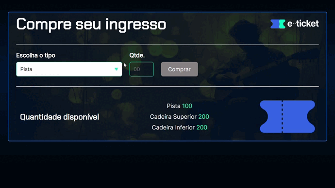

# App Ticket

## About

This application is an example of what happens at concerts and cinemas. This project contains an emphasis on 3 different entrances (lane, upper and lower) where each has a certain amount of entry.

If the user tries to add more inputs than the project is prepared to receive, it will not allow the user to continue with their action, that is, blocking access to the button. There is a ticket limit, and this was defined in the array.

## Layout

Here is the link to access the project - deploy:
[App Ticket](https://app-ticket.vercel.app/).



## How to execute the project?

```bash
# Terminal

git clone https://gitlab.com/mateusdev3400/app-ticket
git clone https://github.com/mateusdev3400/app-ticket

cd app-ticket/

index.html # Live Server

```

## Technologies

The following tools were used in the construction of the project:

### Frontend

- HTML5
- CSS3
- JavaScript

## Contributors

<table>
    <thead>
        <tr>
            <td>
                
            </td>
        </tr>
    </thead>
    <tbody>
        <tr>
            <th>Mateus Maciel</th>
        </tr>
    </tbody>
</table>

### How to contribute

- Fork the project.
- Create a new branch with your changes: ```bash git checkout -b my-feature```
- Save the changes and create a confirmation message telling you what you did: ```git commit -m "modified file"```
- Submit your changes: ```git push origin my-feature```

## Licença

This project is licensed under the Alura Cursos license.